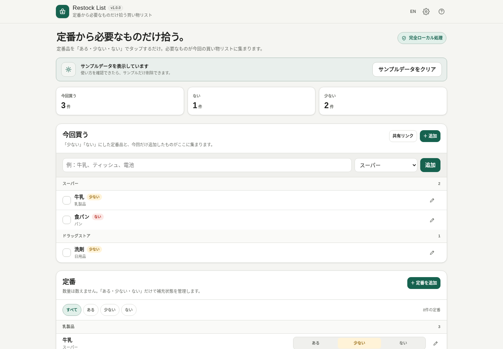
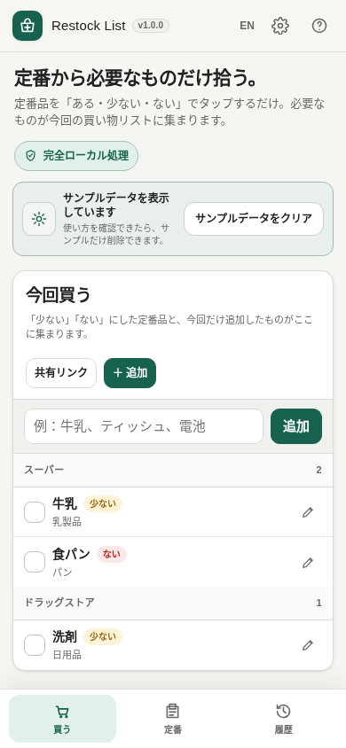

# Restock List

[](https://github.com/ttomohisa/htmlapps-restock-list/actions/workflows/deploy-pages.yml)
[](LICENSE)
[](https://ttomohisa.github.io/htmlapps-restock-list/)

[English README](README.md)

Restock List は、**正確な在庫数を管理せずに、いつもの品物を補充するための完全ローカル処理の買い物リスト**です。

定番品を **「ある / 少ない / ない」** の3状態だけで管理します。「少ない」「ない」にした品物は自動で「今回買う」に集まり、購入チェックすると定番品は「ある」に戻り、購入履歴だけが端末内に残ります。

## 🚀 Live demo

### [GitHub Pages で Restock List を開く](https://ttomohisa.github.io/htmlapps-restock-list/)

GitHub Pages から最初のHTMLを読み込んだ後、定番管理、購入履歴、入力候補、バックアップ / 復元、共有リンク生成はブラウザー内で処理します。買い物データをアプリがサーバーへアップロードすることはありません。

[](https://ttomohisa.github.io/htmlapps-restock-list/)

## 主な機能

- **定番から買い物リストを作る** — 毎回同じリストを作り直さず、定番品を「ある / 少ない / ない」で管理します。
- **買い物中はコンパクトに確認** — 「少ない」「ない」と今回だけの品を店ごとにまとめ、高密度な一覧でチェックできます。
- **入力候補ですばやく追加** — HTML内蔵の定番品辞書と、登録済みの定番品から入力中に候補を表示します。
- **カテゴリ / 店を再利用** — 自由入力しつつ、過去に使ったカテゴリや店を何度でも候補から選び直せます。
- **購入履歴は必要な分だけ** — 購入済みの定番は「ある」に戻り、履歴は個別削除または一括削除できます。
- **アカウントなしで共有** — 現在の買い物リストだけを圧縮したURLフラグメントで共有します。リンクを開いただけでは相手のローカルデータを上書きしません。
- **JSONで持ち運び** — 定番・購入履歴・設定をJSONでバックアップ / 復元できます。
- **単一HTML・完全ローカル処理** — アカウント、アクセス解析、クラウドDB、実行時通信なし。日本語 / 英語UIを内蔵しています。

## クイックスタート

### Web版を使う

[デモを開く](https://ttomohisa.github.io/htmlapps-restock-list/)だけです。インストールやアカウント登録は不要です。

### 単一HTMLを使う

1. このリポジトリをダウンロードまたはcloneします。
2. `dist/index.html` を最新のChromium系ブラウザー、Firefox、Safariで開きます。
3. 定番、状態、購入履歴、設定はそのブラウザープロファイル内に保存されます。

### 単一HTMLを再ビルドする

Windows 10/11 で次を実行します。

```bat
build-standalone.bat
```

生成物は `dist/` に出力されます。生成済みHTMLを直接編集せず、`src/index.template.html` を変更して再ビルドしてください。

## 使い方

1. 最初はサンプルデータで操作を確認し、使い始めるときに **サンプルデータをクリア** します。
2. よく買う品物を **定番** に登録します。
3. 家にある量に合わせて **「ある / 少ない / ない」** を切り替えます。
4. 「少ない」「ない」の品は自動で **今回買う** に表示されます。
5. 今回だけ必要なものは上部の入力欄から追加します。入力中は内蔵辞書と既存の定番から候補が出ます。
6. 買ったらチェックします。定番品は「ある」に戻り、今回だけの品は現在のリストから消えます。
7. 必要に応じて **購入履歴** を確認・個別削除します。

### 共有リンク

**共有リンク** に含まれるのは現在の買い物リストだけです。共有する項目は **品名・店・カテゴリ** で、買い物リストに入っていない定番の状態、購入履歴、設定は含めません。

新しい共有リンクは、品目を短い配列形式に変換し、gzip圧縮してBase64URL化したうえでURLフラグメント（`#list=...`）へ格納します。gzipが利用できないブラウザーではコンパクトな未圧縮形式へフォールバックし、旧形式の未圧縮リンクも引き続き読み込めます。

共有リンクを**開いただけでは、受け取った側のデータは変更されません**。まず「共有された買い物リストがあります」という案内を表示し、**今回のリストに追加**を押したときだけ既存データへマージします。

### バックアップ / 復元

右上の歯車からデータ管理を開けます。

- 定番・購入履歴・設定をJSONとして保存
- バックアップのファイル名を指定
- JSONバックアップを読み込んで現在のローカルデータを置き換え
- 必要に応じてサンプル状態へリセット

## スマホ表示

狭い画面では上部の集計カードを非表示にし、下部を3タブに切り替えます。

- **買う**
- **定番**
- **履歴**

定番一覧は、品名・3状態ボタン・編集操作をできるだけ1行に収め、一覧性を優先しています。



## GitHub Pages で公開する

このリポジトリには、単一HTMLをビルドして `dist/` をGitHub Pagesへ公開するworkflowが含まれています。

1. リポジトリ名を `htmlapps-restock-list` としてGitHubへpushします。
2. **Settings → Pages → Build and deployment → Source** で **GitHub Actions** を選択します。
3. `main` へpushするか、Actionsから **Deploy standalone app to GitHub Pages** を手動実行します。
4. 成功すると `https://ttomohisa.github.io/htmlapps-restock-list/` で利用できます。

デプロイ時にはリポジトリチェック、単一HTMLの再ビルド、実行時通信ブロックの検証を行ってから生成物を公開します。

## 開発・ビルド構成

```text
.
├─ src/index.template.html       # 編集するアプリ本体
├─ app.config.json               # アプリ情報とビルド設定
├─ dependencies.json             # 内包依存（v1.0.0 は0件）
├─ build-standalone.bat          # Windows向けビルド入口
├─ build-standalone.ps1          # 単一HTMLビルダー
├─ scripts/                      # リポジトリ / ビルド検証
├─ assets/                       # favicon・スクリーンショット
└─ dist/
   ├─ index.html                 # 読みやすい単一HTML版
   └─ index.self-extract.html    # gzip自己解凍版
```

## プライバシーと実行時通信

アプリデータは利用可能な場合にブラウザーの `localStorage` へ保存します。生成HTMLには `connect-src 'none'` を含むContent Security Policyがあり、アプリ自身は実行時ネットワーク通信を行えません。

GitHub Pages版では最初のHTML取得だけは必要ですが、買い物データをアプリが送信することはありません。共有データはURLの `#` 以降に入るフラグメントで、通常のHTTPリクエストとしてサーバーへ送る部分ではありません。

完全にネットワークを切った状態で使う場合は `dist/index.html` を直接開けます。ただし共有リンクは、他端末からアクセス可能な `http/https` の公開ページで利用する想定です。

## 対応ブラウザー / 端末

デスクトップ・モバイルともに、現行のChromium系ブラウザー、Firefox、Safariを主な対象としています。定番管理と買い物画面は320px幅以上を想定しています。`CompressionStream` / `DecompressionStream` が利用できる場合は共有データをgzip圧縮し、利用できない場合はコンパクトな未圧縮形式へフォールバックします。

## 制限事項

- データはブラウザープロファイルとoriginごとに保存されます。サイトデータを削除すると消える可能性があるため、必要に応じてJSONバックアップを保存してください。
- 共有リンクはスナップショットで、リアルタイム同期ではありません。
- 共有URLには品名・店・カテゴリがエンコードされた状態で含まれます。URLに含めたくない情報の共有には使用しないでください。
- 内蔵の商品辞書は入力補助用の軽量なもので、完全な商品カタログではありません。
- 店ごとのグルーピングは行いますが、店内の移動順を自動計算する機能はありません。

## 依存関係

Restock List v1.0.0 は**サードパーティ製ランタイム依存 0**です。`localStorage`、利用可能な場合の `CompressionStream` / `DecompressionStream`、Blob URL、Web Share / Clipboard APIなど、ブラウザー標準APIを利用します。

詳細は [THIRD_PARTY_NOTICES.md](THIRD_PARTY_NOTICES.md) を参照してください。

## Contributing

不具合報告や機能提案はGitHub Issuesから歓迎します。開発ガイドは [CONTRIBUTING.md](CONTRIBUTING.md) を参照してください。

## License

Copyright © 2026 ttomohisa

[MIT License](LICENSE) の下で公開しています。
