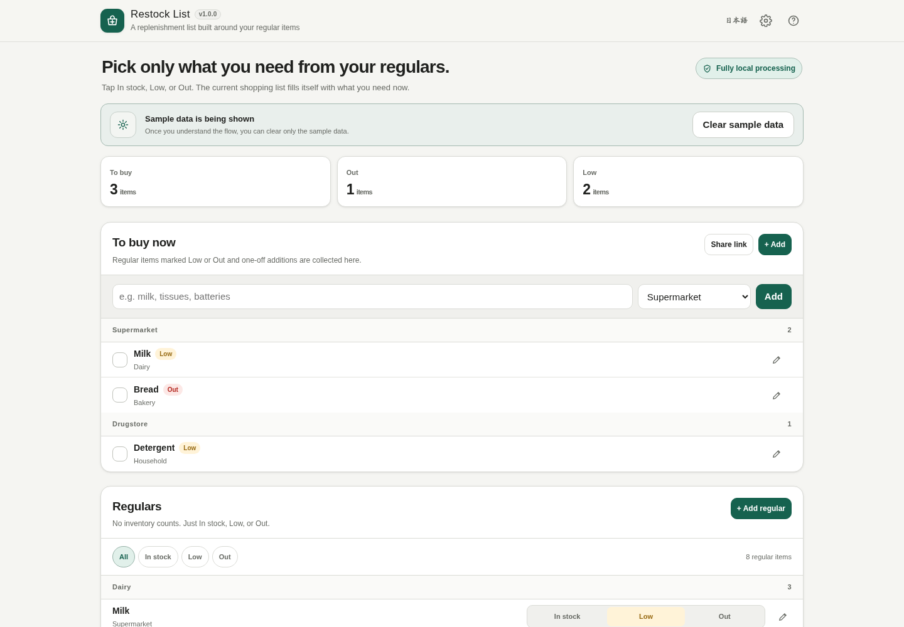
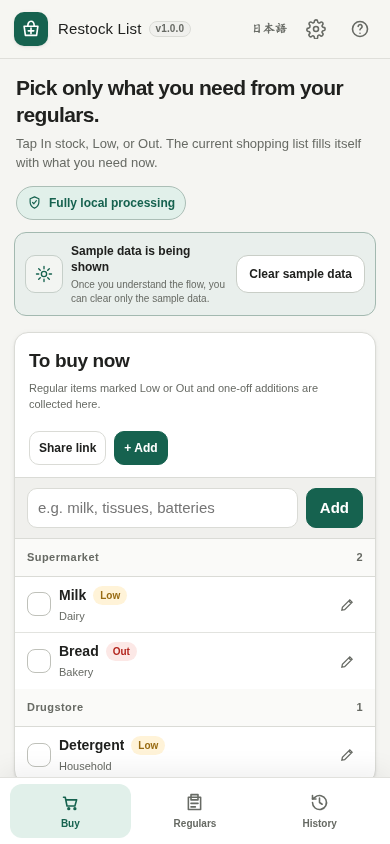

# Restock List

[](https://github.com/ttomohisa/htmlapps-restock-list/actions/workflows/deploy-pages.yml)
[](LICENSE)
[](https://ttomohisa.github.io/htmlapps-restock-list/)

[日本語版 README](README.ja.md)

A privacy-focused, single-HTML shopping list for replenishing everyday items without maintaining exact inventory counts.

Keep regular items in just three states — **In stock / Low / Out**. Items marked Low or Out automatically appear in the current shopping list, and checking them off returns regular items to In stock while recording purchase history locally.

## 🚀 Live demo

### [Open Restock List on GitHub Pages](https://ttomohisa.github.io/htmlapps-restock-list/)

GitHub Pages delivers the initial HTML. After it loads, item management, purchase history, suggestions, backup/restore, and share-link generation are processed locally in the browser. The app does not upload your shopping data to a server.

[](https://ttomohisa.github.io/htmlapps-restock-list/)

## Features

- **Build the list from regular items** — Mark a regular item In stock, Low, or Out instead of recreating the same shopping list every time.
- **Shop from one compact screen** — Low, Out, and one-off items are grouped by store with a dense, mobile-friendly layout.
- **Add items quickly** — Type a product name and pick from built-in everyday-item suggestions or your existing regular items.
- **Reuse categories and stores** — Category and store fields accept free text while also letting you reopen and select previously used values.
- **Record only what matters** — Purchased regular items return to In stock, and purchase history can be deleted individually or all at once.
- **Share without an account** — Share only the current shopping list through a compressed URL fragment. Opening a shared link does not overwrite local data; the recipient explicitly chooses whether to merge it.
- **Keep data portable** — Export and restore regular items, history, and settings as JSON.
- **Private, single-HTML operation** — No account, analytics, cloud database, or runtime network access. Japanese and English UI are included.

## Quick start

### Use the web demo

Just [open the demo](https://ttomohisa.github.io/htmlapps-restock-list/). No installation or account is required.

### Use the standalone file

1. Download or clone this repository.
2. Open `dist/index.html` in a current Chromium-based browser, Firefox, or Safari.
3. Your regular items, states, history, and settings stay in that browser profile.

### Rebuild the single HTML file

On Windows 10/11:

```bat
build-standalone.bat
```

The generated files are written to `dist/`. Edit `src/index.template.html`, not the generated HTML directly.

## Usage

1. Review the sample data, then use **Clear sample data** when you are ready to start with an empty list.
2. Add frequently purchased items under **Regulars**.
3. Change each regular item between **In stock / Low / Out**.
4. Items marked Low or Out automatically appear under **To buy now**.
5. Add one-off items directly from the quick-add field. Typing shows built-in product suggestions and matching regular items.
6. Check an item when purchased. Regular items return to In stock; one-off items leave the active list.
7. Review or delete entries under **Purchase history** when needed.

### Share links

The **Share link** action includes only the current shopping list — item name, store, and category. Regular-item states outside the active list, purchase history, and settings are not included.

New share links use a compact row format, gzip compression, and Base64URL encoding inside the URL fragment (`#list=...`). If gzip compression is unavailable, the app falls back to an uncompressed compact format. Older uncompressed links remain readable.

Opening a shared link does **not** replace or erase the recipient's local data. The link first shows a received-list banner. Only after the recipient chooses **Add to my list** are the shared items merged into the current local list.

### Backup and restore

Open the gear icon to manage data:

- Export regular items, purchase history, and settings as JSON.
- Choose the backup filename before downloading.
- Import a JSON backup to replace the current local dataset.
- Reset everything to the bundled sample data when needed.

## Mobile UI

On narrow screens, the desktop summary metrics are hidden and the app switches to three fixed bottom tabs:

- **Buy**
- **Regulars**
- **History**

Regular-item rows stay compact so the item name, three-state control, and edit action remain easy to scan on a phone.



## Publish with GitHub Pages

The repository includes a workflow that builds the standalone HTML and deploys `dist/` to GitHub Pages.

1. Push the repository to GitHub as `htmlapps-restock-list`.
2. Open **Settings → Pages → Build and deployment → Source** and select **GitHub Actions**.
3. Push to `main`, or manually run **Deploy standalone app to GitHub Pages** from the Actions tab.
4. After a successful deployment, the demo is available at `https://ttomohisa.github.io/htmlapps-restock-list/`.

Each deployment runs the repository checks, rebuilds the standalone HTML, verifies the runtime network block, and publishes the generated files.

## Development and build layout

```text
.
├─ src/index.template.html       # Editable application source
├─ app.config.json               # App metadata and build settings
├─ dependencies.json             # Pinned embedded dependencies (none in v1.0.0)
├─ build-standalone.bat          # Windows build entry point
├─ build-standalone.ps1          # Standalone HTML builder
├─ scripts/                      # Repository/build verification scripts
├─ assets/                       # Favicon and screenshots
└─ dist/
   ├─ index.html                 # Readable standalone app
   └─ index.self-extract.html    # Gzip self-extracting standalone app
```

## Privacy and runtime network protection

Restock List stores app data in browser `localStorage` when available. The generated HTML includes a Content Security Policy with `connect-src 'none'`, so the app itself cannot make runtime network requests.

The GitHub Pages version requires the initial HTML request, but shopping-list data is not sent by the app. Shared-list payloads live after `#` in the URL; URL fragments are not part of the normal HTTP request to the server.

For fully disconnected use, open `dist/index.html` locally. Share-link creation is intended for the published `http/https` version because a local `file://` URL is not useful to another device.

## Supported browsers and devices

Current stable Chromium-based browsers, Firefox, and Safari are the primary targets on desktop and mobile. The regular-item and shopping flows are designed to work from 320px-wide screens upward. `CompressionStream` / `DecompressionStream` are used when available; share encoding falls back to a compact uncompressed format when gzip compression is unavailable.

## Limitations

- Data is local to the browser profile and origin. Clearing site data can remove it, so export a JSON backup when needed.
- Share links are snapshots, not real-time synchronization.
- A shared URL necessarily contains the shared item names, stores, and categories in encoded form. Do not use it for information you do not want to place in a URL.
- The built-in product dictionary is intentionally lightweight and is not a full product catalog.
- Store ordering is grouping only; the app does not calculate an in-store walking route.

## Dependencies

Restock List v1.0.0 has **no third-party runtime dependencies**. The app uses browser-native APIs such as `localStorage`, `CompressionStream` / `DecompressionStream` when available, Blob URLs, and the Web Share / Clipboard APIs.

See [THIRD_PARTY_NOTICES.md](THIRD_PARTY_NOTICES.md) for details.

## Contributing

Bug reports and feature proposals are welcome through GitHub Issues. See [CONTRIBUTING.md](CONTRIBUTING.md) for development guidance.

## License

Copyright © 2026 ttomohisa

Licensed under the [MIT License](LICENSE).
